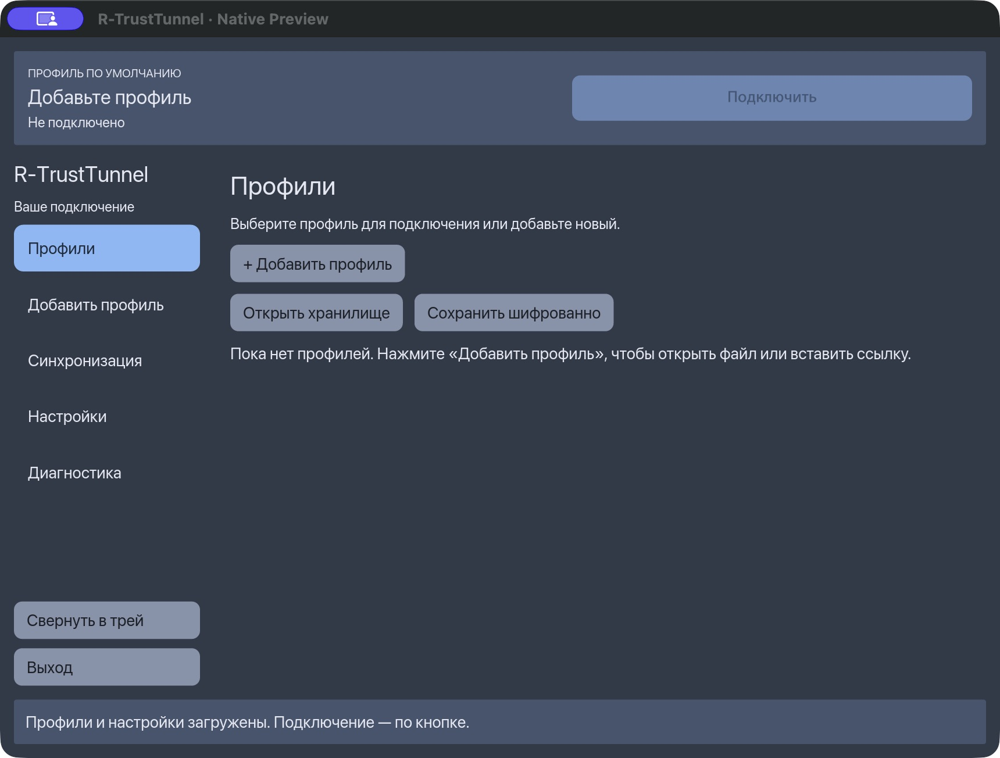
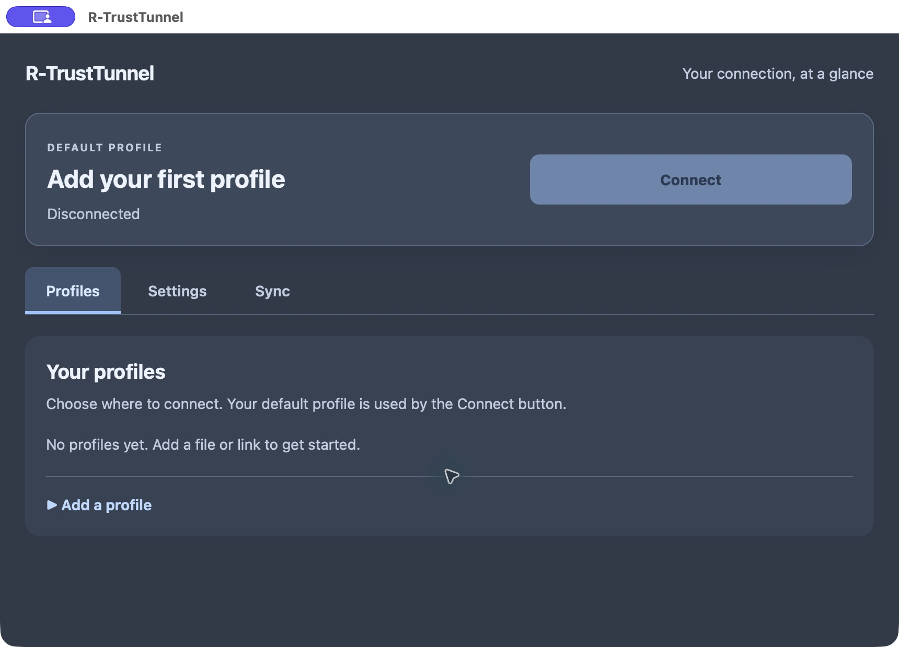

# R-TrustTunnel

[English](Readme.md) · [Русский](readme_ru.md)

A native desktop VPN client written in Rust, compatible with TrustTunnel and Hysteria 2, with a server-panel extension for importing, exporting and synchronizing connection profiles. The client implements its own transport; it does not wrap the official CLI.

**Status: development preview, October 1, 2026.** Windows, Linux and macOS have working system-tunnel implementations. The UI refresh release is published; platform acceptance limits are listed below. Android now has a native VpnService preview with a shared Rust core; a desktop Tauri WebView frontend is now implemented as an additional preview.

## Download and install

Current release: **[v0.3.2-ui.2](https://github.com/onixus/Rust-trustvpn/releases/tag/v0.3.2-ui.2)**, a preview published October 1, 2026.

| Platform | Package | Installation |
| --- | --- | --- |
| macOS Apple Silicon | [DMG: Native / WebView / Both](https://github.com/onixus/Rust-trustvpn/releases/download/v0.3.2-ui.2/R-TrustTunnel-macOS-arm64-UI-Choices.dmg) | Open the DMG and choose one PKG. Administrator authorization is required; no Developer ID or notarization. |
| Linux x86_64, Wayland | [Native](https://github.com/onixus/Rust-trustvpn/releases/download/v0.3.2-ui.2/R-TrustTunnel-Linux-x86_64.flatpak) · [WebView](https://github.com/onixus/Rust-trustvpn/releases/download/v0.3.2-ui.2/R-TrustTunnel-Linux-x86_64-webview.flatpak) · [Both](https://github.com/onixus/Rust-trustvpn/releases/download/v0.3.2-ui.2/R-TrustTunnel-Linux-x86_64-both.flatpak) | Choose one Flatpak. System VPN also requires the separate host service; see [Linux instructions](docs/linux-service.md). |
| Android 10+, arm64 / x86_64 | [Signed APK](https://github.com/onixus/Rust-trustvpn/releases/download/v0.3.2-ui.2/R-TrustTunnel-Android.apk) | Updates the previous signed preview in place. Build **30209**; version `0.3.2-preview.7`. |
| Windows x64 | No new package in this release | Updated UI build and acceptance are deferred until the Windows node is available. |

The [release page](https://github.com/onixus/Rust-trustvpn/releases/tag/v0.3.2-ui.2) also provides the signed Arch host package `rtrust-host-0.3.2-23`, `SHA256SUMS`, signatures and validation evidence. Native Flatpak uses Freedesktop 25.08; WebView/Both use GNOME 50. Preserve the signing identity and application data when upgrading.

Selected icon **#6, Flow** is included in apps, tray, installers and the Android adaptive launcher. Packages passed macOS Jenkins #73, Linux #23 and Android #30. Windows branding is prepared in source; its new build remains deferred. [Release scope](docs/releases/v0.3.2-ui.2.md).

## Screenshots

Actual Native and WebView windows from `v0.3.2-ui.1` on macOS, with an empty vault and VPN disconnected. [Gallery and connection settings](docs/screenshots/README.md).

| Native | WebView |
| --- | --- |
|  |  |

## Features

- Native Rust/iced desktop UI with a default-profile connect/disconnect button, system tray, profile management and connection diagnostics.
- Import and export of endpoint TOML, full client TOML, JSON and `tt://` links, with preview, validation and explicit replacement of existing profiles.
- Automatic profile persistence in an encrypted vault; the encryption key is stored in the OS credential store. There is no plaintext fallback.
- HTTP/2 system VPN, IPv4/IPv6 TCP and UDP, ICMP echo, bounded fragmentation handling, reconnect and protection against direct-traffic bypass.
- Local SOCKS5 mode over HTTP/2 or HTTP/3 for applications that support a proxy.
- Profile exchange through the native UI and server panel: device enrollment, scoped access, import preview/commit, synchronization and conflict detection.
- Signed update manifests and a tested Windows upgrade/rollback path. Windows/macOS platform signing is separate: there is no Developer ID/notarization. Android APKs and Linux release artifacts are signed.

TrustTunnel HTTP/3 for **system VPN** is deferred to [wave 3](docs/technical-debt.md). An imported TrustTunnel HTTP/3 profile is retained, while the system-tunnel connection uses HTTP/2.

Hysteria 2 configurations and links select the new QUIC transport automatically. TCP, UDP and Salamander are implemented in the shared engine. See [supported fields and verification limits](docs/hysteria2.md); platform acceptance of this addition is in progress.

## Platform status

| Platform | Implementation and validation | Remaining work |
| --- | --- | --- |
| Windows x64 | Native `.exe`, Setup installer, Wintun/SCM service and WFP guard. Real system-tunnel, service-crash, reconnect, upgrade and rollback checks have passed. | Cold boot and sleep/wake acceptance; delivery of the latest shared UDP recovery fix to the installed release. |
| Linux ARM64 / x86_64 | Wayland native UI, TUN service, nftables and systemd-resolved. Native x86_64 CI and physical Plasma/Wayland, tray, KWallet and portals passed. Arch host-package lifecycle and signed Flatpak update/rollback tested. ARM64 retains its earlier container coverage. | Physical reboot/sleep and final GUI installer acceptance. A signed HTTPS candidate repository has passed anonymous installation. |
| macOS Apple Silicon | Native app and root LaunchDaemon using `utun`. Installed system candidate passed live IPv4/IPv6, DNS, reconnect, GUI/service-crash and recovery tests. PKG inside an unsigned DMG. | Boot always-on, sleep/network handoff, clean installation on another Mac and automatic update/rollback. No Developer ID or notarization. |
| Android arm64 / x86_64 | Native APK, Rust/JNI VpnService, Keystore, file/tt/QR import, app selection, Russian UI, portal enrollment/manual and background sync, system Always-on/lockdown. | Additional OEMs, reboot before first unlock and long soak. See [Android preview](docs/android.md). |

Desktop packaging supports Native/WebView/Both variants. The native frontend remains the default; WebView uses the shared Rust connection controller and encrypted vault. Windows installer validation is deferred while its node is offline. See [desktop UI choices](docs/ui-choices.md). Linux uses Wayland only.

## Build and run

Use Rust with Cargo; the workspace declares Rust 1.89 or newer, and CI currently pins 1.98.1. Native builds also require the target platform's compiler and libraries. Linux requires Wayland, Fontconfig, D-Bus, a desktop file portal and an available Secret Service backend for the vault. See the [CI setup](docs/jenkins.md) for the tested environments.

```sh
git clone https://github.com/onixus/Rust-trustvpn.git
cd Rust-trustvpn
cargo run -p rtrust-native --locked

# Open a synthetic example for preview; it does not connect to a real server.
cargo run -p rtrust-native --locked -- examples/demo.endpoint.toml
```

Run the GUI as your normal desktop user. System VPN requires the separately installed privileged service; starting the GUI alone does not install that service.

```sh
cargo build --release -p rtrust-native -p rtrust-tun -p rtrust-inspect --locked
```

Packaging entry points:

- **Windows:** `python ci/package_windows.py`; produces `dist/R-TrustTunnel-Windows-x64-Setup.exe`. Follow [Windows service prerequisites](docs/windows-service.md), including the pinned Wintun dependency. Windows 10 2004+ x64 is required.
- **macOS:** `python3 scripts/package-macos-system.py`; produces a system-service PKG and `dist/R-TrustTunnel-macOS-arm64-system-candidate.dmg`. Installation needs administrator authorization. See [macOS system VPN](docs/macos-system.md).
- **Android:** `python3 scripts/build-android.py`; builds native APKs with SDK 36 / NDK 28.2. Release signing is separate. See [Android build and limitations](docs/android.md).
- **Linux:** `python3 scripts/package-flatpak.py` on Linux with Flatpak builder 1.4.4+ and the Freedesktop 25.08 SDK/runtime. Cross-built binaries can be supplied with `--arch x86_64 --binary-dir PATH`. See [Linux service and Flatpak status](docs/linux-service.md).

Generated installers, Flatpak bundles and local test reports are excluded from Git. Ready-to-install packages are published in GitHub Releases above; binaries are not stored in Git history. Flatpak contains the unprivileged GUI; it does not install the host VPN service or receive arbitrary host-command access.

## Using the client

### Windows, Linux and macOS

1. Import a configuration file or `tt://`, `hy2://`, `hysteria2://` link, review it and add the profile.
2. Choose the default profile and select the connection mode in Settings. For system VPN, install the matching service first.
3. Use the top connect/disconnect button. Closing the window hides it in the tray; use **Exit** to quit.
4. Profile changes are saved automatically in the encrypted vault. Server profile exchange is available through the [portal interface](docs/portal.md).

For SOCKS5 mode, configure your application to use `127.0.0.1:1080` or the port selected in the client. For example:

```sh
curl --socks5-hostname 127.0.0.1:1080 https://example.com
```

SOCKS5 mode does not change system routes, DNS or proxy settings. Other local processes can access the loopback proxy. SOCKS UDP domain addressing, SOCKS UDP fragmentation and BIND are not supported.

Login startup, GUI autoconnect and boot-level always-on are different features. Their platform limits and recovery behavior are described in [desktop lifecycle](docs/desktop-lifecycle.md) and [always-on](docs/always-on.md).

### Android

The signed APK in **v0.3.2-ui.2** has versionCode **30209** and versionName **0.3.2-preview.7**.

1. Install the APK. Open **+ Add profile** to import a file, paste a configuration/`tt://`/`hy2://` link, or import a QR code using the camera or an image.
2. Choose the default profile and use the bottom connect button. Accept Android VPN consent; no separate host service is needed.
3. Use **VPN apps** to select all apps or an allowlist. Disconnect before changing it. English and Russian follow the system locale.
4. For protection after force-stop, open **Settings → Always-on / block bypass** and enable **both** Android settings: Always-on VPN and Block connections without VPN. Excluded apps have no Internet under lockdown. Change the system setting before manually disconnecting.
5. Use **Settings → Server profiles** to enroll with a one-time code, grant access in the server UI and synchronize manually with VPN disconnected, or enable hourly background sync. Background changes apply on the next connection. Upload requires explicit consent to transfer credentials.

Physical POCO X3 NFC / Android 12 acceptance covered camera/image QR, the system
file picker, all four export formats, server exchange and traffic blocking for a
separate app UID after force-stop. VPN connectivity was then restored. Android
Jenkins **#16 — SUCCESS**; validated source commit: `2809bea`. Reboot before first
unlock, additional OEMs and overnight soak remain unverified.
Huawei DEL-LX9 / Android 12 also passed production connectivity, Wi-Fi/mobile
handoff, camera/file import, four export formats, app selection, same-version
reinstall and system lockdown/recovery checks on October 1, 2026.
[Android instructions](docs/android.md) · [Profile exchange](docs/portal.md).

Earlier Hysteria 2 acceptance: Android Jenkins **#26**, Linux **#18** and macOS **#66** completed successfully. Linux system-service tests cover TrustTunnel and Hysteria 2, including route/firewall recovery and Always-on. Huawei passed production Hysteria 2, DNS/Google HTTPS/UDP, DoH/DoT, and a real background portal-worker sync. Native/WebView/Both Flatpaks built; both frontends passed physical Wayland smoke. Windows testing of this addition remains deferred.

## Development and validation

```sh
cargo fmt --all --check
cargo test --workspace --locked
cargo clippy --workspace --all-targets --locked -- -D warnings
```

The preceding v0.3.2-ui.1 UI refresh passed **macOS Jenkins #69** and **Linux Jenkins #20**, including Gitleaks/Trivy, unit, build, smoke and network E2E. After the installed macOS upgrade, GUI/service access passed and the encrypted vault hash was unchanged. Native, WebView, Both, tray and updated host-service IPC passed on physical KDE Wayland. Huawei was upgraded to APK build 30208 with its profile, VPN connection and Always-on/lockdown retained; the UI change also passed Android build and lint. This is not a new full Android CI run: the latest full core pipeline is #26.

Windows was excluded; earlier system acceptance belongs to #53 and sequence 6. The boot/sleep/soak items above remain open. See [release contents and validation](docs/releases/v0.3.2-ui.1.md).

Network and installer harnesses may change routes or firewall rules. Follow their documented disposable-environment requirements. Local Jenkins node names and paths need adaptation for another installation.

## Repository layout

| Path | Purpose |
| --- | --- |
| `apps/native`, `apps/webview` | Native desktop application and optional Tauri frontend |
| `apps/tun` | TUN/Wintun/utun dataplane and platform services |
| `apps/inspect`, `apps/codec` | Diagnostic and configuration tools |
| `crates/` | Shared profiles, transport, storage, IPC, portal and update logic |
| `server/`, `deploy/` | Profile exchange portal extension, its tests and deployment tools |
| `packaging/`, `scripts/` | Platform packaging and interoperability harnesses |
| `ci/`, `Jenkinsfile` | Build, security and runtime checks |
| `vendor/h2` | Patched HTTP/2 dependency, with its own license |
| `docs/` | Architecture, implementation status and acceptance limits; many documents are in Russian |

The server extension targets an existing TrustTunnel panel; it is not a replacement endpoint installer. Start with [server integration](server/README.md) and [deployment](deploy/README.md).

## Documentation

- [Current implementation status](docs/implementation.md)
- [Delivery order and acceptance criteria](docs/delivery.md)
- [Architecture](docs/architecture.md)
- [Windows service](docs/windows-service.md), [Linux service](docs/linux-service.md), [macOS system VPN](docs/macos-system.md)
- [Secure updates](docs/secure-updates.md)
- [Profile exchange API](docs/profile-api.md)
- [Technical debt](docs/technical-debt.md)

Historical documents may refer to local reports or artifacts that are not shipped in this repository. Current platform status takes precedence over older milestone notes.

## License

[Apache License 2.0](LICENSE). Vendored dependencies retain their respective licenses.
