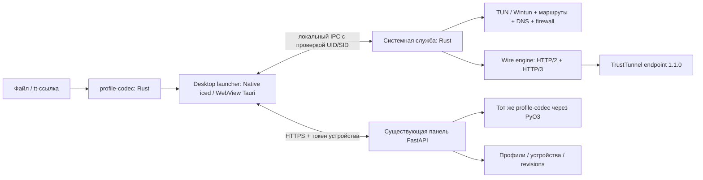
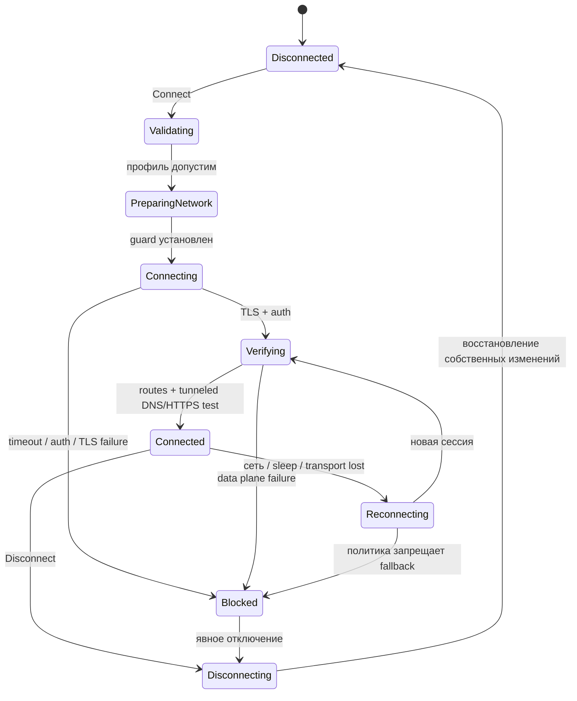

# Архитектура R-TrustTunnel

Дата: 2026-09-30. Статус: предлагаемый проект; ни один пункт будущего поведения не является утверждением о готовой реализации.

## 1. Цель и границы

Пользователь устанавливает приложение, загружает файл, вставляет `tt://` или входит в свою панель и нажимает «Подключить». Терминал и запуск GUI от администратора не нужны. После сна, смены Wi-Fi и временной потери сервера приложение восстанавливает соединение и точно показывает, защищён ли трафик.

Первоначальные целевые платформы: Windows 11 x64, Ubuntu 24.04 LTS x64, Debian 12/13 x64 и актуальная Fedora x64; GNOME/KDE, Wayland. Это план тестирования, не декларация уже проверенной поддержки. Windows ARM64, Linux ARM64 и Windows 10 — отдельные матрицы после x64. **Вторая волна — Android и macOS**, после приёмки Windows/Linux; детали в [android-macos.md](android-macos.md). Для iOS начат экспериментальный порт SwiftUI + Network Extension; статус и ограничения — в [ios.md](ios.md).

Панель остаётся в `/opt/trusttunnel-web`: FastAPI, существующие пользователи, устройства, профили, email-доставка. VPN endpoint не заменяем и wire protocol не расширяем. Серверный и клиентский интерфейсы поддерживают импорт и экспорт; серверный импорт различает восстановление локальной учётной записи и хранение профиля внешнего сервера.

## 2. Компоненты и выбор технологий

Схема ниже описывает первую волну Windows/Linux. Во второй волне тот же Rust engine работает внутри Android VpnService или macOS Network Extension: desktop root service, WFP/nftables и Unix-socket IPC не переносятся на них механически.



| Компонент | Решение | Причина / граница |
|---|---|---|
| Native GUI, по умолчанию | Rust + iced, архитектура Message/State/Task | Самостоятельное приложение Windows/Linux, без WebView dependency |
| Дополнительный WebView GUI | Tauri + локальные UI assets, Rust host | Отдельное desktop-окно; выбирается при установке, Node.js в runtime не нужен |
| Общий application layer | Rust view models/actions, launcher, единый IPC client | Одинаковые профили, операции и состояния для обоих UI |
| Асинхронность | Tokio | Отмена задач, bounded channels, таймауты |
| HTTP/2 | h2 + rustls | Низкоуровневый CONNECT, управление потоком и half-close |
| HTTP/3 | quinn + h3/h3-quinn | CONNECT поверх QUIC, проверка нестандартных pseudo-host в spike |
| IP → потоки | Адаптер userspace TCP/IP на базе smoltcp | TUN содержит IP-пакеты, а TrustTunnel передаёт TCP-потоки и UDP-сообщения |
| Linux | /dev/net/tun, rtnetlink, nftables; D-Bus resolved/NM | Управление сетью через структурированные API |
| Windows | Wintun, IP Helper/DNS API, WFP, Windows Service | TUN-драйвер, маршруты и постоянные firewall-правила |
| Профили | serde, toml_edit, собственная безопасная обвязка TLV | Разделение endpoint TOML, CLI TOML и внутренней модели |
| Серверный codec | Rust crate + PyO3 wheel, установленный в образ панели | Одни правила чтения/записи для Python-панели и клиента |
| Хранение | SQLite для метаданных; OS vault для ключей | Пароли и токены не попадают в обычные JSON/SQLite поля клиента |

Версии зависимостей и MSRV фиксируются после spike в `Cargo.lock`; принадлежность библиотеки к Rust не означает готовую совместимость или отсутствие native dependencies. `iced` подтверждает поддержку Windows/Linux; проверка доступности, IME, tray, масштабирования и software-rendering входит в первую веху. Если её требования не выполнены, UI ADR пересматривается до разработки всех экранов. [iced](https://github.com/iced-rs/iced), [smoltcp](https://docs.rs/smoltcp/latest/smoltcp/), [h3](https://docs.rs/h3/latest/h3/).

Предлагаемая структура workspace:

```text
apps/launcher/          R-TrustTunnel.exe / rtrust, выбор UI, file/URI dispatch
apps/ui-native/         iced UI, интеграция Windows/Plasma
apps/ui-webview/        Tauri host + bundled frontend, узкий IPC bridge
crates/app-controller/  общие view models, операции, profile store, panel session
apps/service/           lifecycle, authorised IPC, network transactions
crates/profile-model/  ProfileV1, capability flags, validation errors
crates/profile-codec/  endpoint TOML, CLI TOML, tt, canonical export
crates/tt-wire/        CONNECT, UDP/ICMP framing, session health
crates/tt-transport/   h2/h3, TLS backend abstraction
crates/ip-stack/       TUN packet to flow adapter, backpressure
crates/net-linux/      TUN, routing, DNS, nftables
crates/net-windows/    Wintun, routes, DNS, WFP
apps/android/         волна 2: Kotlin/Compose, VpnService, Rust bindings
apps/macos/           волна 2: SwiftUI/AppKit host, выбор desktop UI
extensions/macos-vpn/ волна 2: packet tunnel provider + Rust engine
crates/platform-api/  packet I/O, socket protection, lifecycle, secret handles
bindings/mobile/      versioned Kotlin/Swift bindings к общему Rust core
crates/ipc/            versioned requests/events and secret redaction
crates/profile-store/ metadata, encrypted blobs, migration
bindings/python/      codec for existing server
tests/interop/        pinned upstream + synthetic fixtures
packaging/            Setup.exe/MSI, Linux GUI setup, deb/rpm components
```

## 3. Самостоятельный Rust engine и честная совместимость

Целевой клиент не запускает `trusttunnel_client` и не парсит его stdout. Официальный клиент нужен как эталон в тестах. По [спецификации протокола](https://github.com/TrustTunnel/TrustTunnel/blob/81eb23995b7d45aac7aeeac286040cc499b945c7/PROTOCOL.md) реализуются TLS/ALPN, авторизованные CONNECT, отдельный TCP stream на соединение, UDP через `_udp2`, ICMP echo через `_icmp`, health через `_check`, flow control, отмена и восстановление сессии. UDP TrustTunnel нельзя подменять произвольными QUIC datagrams.

TUN → userspace stack должен корректно обрабатывать TCP retransmit/half-close, window updates, UDP mapping/expiry, IPv4/IPv6, checksum, ICMP errors и MTU/fragmentation. Нужен адаптер для произвольных адресов назначения; простого подключения готового smoltcp Interface недостаточно. Производительность и TCP semantics проверяются прежде, чем фиксировать этот stack как окончательный. Буферы ограничены на flow и на весь engine; переполнение приводит к явному backpressure/drop/reset, а не неограниченному росту памяти. Трафик не выгружается во временные файлы.

Transport capabilities и parse capabilities различаются. Профиль может успешно прочитаться, но требовать ещё не поддержанного механизма. Тогда UI сохраняет его с точной причиной и запрещает подключение, а не молча удаляет настройку.

| Возможность | Целевой релиз | Промежуточная поставка |
|---|---|---|
| h2 + TCP/UDP + TLS/CA | Обязательно | Первая interop-веха |
| h3 + TCP/UDP + fallback | Обязательно | Самостоятельная interop-веха до beta |
| ICMP echo | Обязательно для обещанной полной поддержки | До реализации отмечен неподдержанным |
| IPv6 | Туннелировать либо явно блокировать | Никакого обхода через физический IPv6 |
| custom_sni ≠ hostname | Проверка по hostname при отдельном SNI | TLS-adapter spike; не отключать верификацию |
| client_random prefix/mask | Учитывать серверные admission rules | Блокер профиля до подтверждённого backend |
| anti_dpi / tls_profile | Отдельная измеримая parity-работа | Не выдавать обычный rustls ClientHello за Chrome |
| post_quantum_group_enabled | Проверенный provider и negotiation | Явное предупреждение/блокировка требуемой политики |
| DoH/DoT/DoQ, DNS stamps | По опубликованной capability matrix | Не переключать неизвестный DNS на plaintext |
| domain/app split tunnel | Domains после базового туннеля; apps позже | Неподдержанные правила не игнорируются |

Самый большой риск — TLS-поведение. `rustls` не объявляется заменой upstream fingerprinting, модификации ClientHello random и anti-DPI. Сначала проверяется стандартный Rust backend. Затем отдельное решение: реализуемый Rust adapter/fork с сопровождением либо согласованная native TLS-библиотека с узким FFI. Включение C/C++ в runtime меняет обещание «Rust engine» и требует отдельного ADR. До этого релиз не маркируется «полностью совместим со всеми профилями». DPI-устойчивость проверяется в пользовательских сетях, не выводится из самого использования HTTPS.

## 4. Файлы, ссылки и нормализованная модель

Поддерживаемые входы:

1. **Endpoint TOML:** поля `hostname`, `addresses`, credentials и TLS в корне; `client_random_prefix`.
2. **CLI TOML:** `[endpoint]`, `[listener.tun]` / `[listener.socks]`, routing/DNS/kill switch; `endpoint.client_random`.
3. **tt-ссылка:** официальный `tt://?<base64url TLV>` v0/v1; legacy `tt://<payload>` принимается без lowercasing payload. Новый экспорт всегда `tt://?`.
4. **Panel JSON:** текущий формат `label/address/port/domain/sni/protocol/username/password/deeplink` через отдельный legacy adapter.
5. **R-TrustTunnel profile v1:** versioned JSON для полного обмена политиками; это новый формат, не приписываем его официальному клиенту.

Неоднозначный TOML, одновременно содержащий два конфликтующих endpoint, отклоняется. Из server-side `vpn.toml`, `hosts.toml` и файлов приватного ключа нельзя создать клиентский профиль. Произвольный `.txt` с описанием не исполняется и не становится конфигом по эвристике.

`ProfileV1` содержит: UUID, schema_version, display_name, origin (`local`, `portal_managed`, `external_stored`), endpoint, credentials reference, routing, DNS, kill-switch policy, capability requirements, server revision и local override revision. Endpoint разделяет:

- `addresses[]` — транспортные адреса, IPv6 только с корректным bracket/port parsing;
- `hostname` — идентификатор проверки сертификата;
- `custom_sni` — независимое значение SNI;
- `certificate` — доверенная цепочка из конкретного профиля, без установки глобального CA;
- `username/password` — секреты; при хранении только через ссылку на vault;
- `upstream_protocol` и отдельная локальная политика fallback, `has_ipv6`, random prefix, anti-DPI, TLS profile.

`tt://` не несёт полный routing/listener/kill-switch state. Экспорт UI показывает список потерь: «В ссылку попадут параметры сервера; маршруты и настройки устройства не войдут». Для полного переноса — CLI TOML в пределах его возможностей или versioned JSON. Обратное преобразование сравнивается семантически, а не побайтово.

Правила `tt` следуют [официальному DEEP_LINK.md](https://github.com/TrustTunnel/TrustTunnel/blob/81eb23995b7d45aac7aeeac286040cc499b945c7/DEEP_LINK.md): TLV на QUIC varint, неизвестные tags пропускаются, повторные addresses добавляются, остальные singleton-поля используют последнее значение; отсутствие версии означает v0, будущая версия запрещена. Внутренняя запись может сохранять неизвестные tags для loss-aware round trip, но engine их не интерпретирует.

Перед использованием upstream Rust codec требуется аудит: в проверенной ревизии tag `u64` преобразуется в `u8`, что может алиасить неизвестный tag. Наш wrapper/parser обязан сравнивать полный tag, проверять `length <= remaining`, overflow и все границы до выделения памяти. Заимствованный codec не считается безопасным без differential/fuzz tests.

Предлагаемые лимиты: файл ≤1 MiB; tt URI ≤64 KiB (не менее требуемых upstream 8 KiB); 64 endpoint address; 32 DNS upstream; 4096 routing rules; глубина JSON ≤16. Строки NUL/CRLF в адресах/credentials для HTTP отвергаются; Unicode display name допустим. Полный ввод не включать в ошибки. Unknown TOML сохраняется для loss report; сетевое или security-поле, которого engine не понимает, блокирует Connect до явного изменения пользователем.

`skip_verification=true` читается для диагностики, но такой профиль по умолчанию не подключается: предложить добавить корректный CA/hostname. Это осознанное ограничение безопасности, указанное в compatibility report. Импорт не запускает DNS lookup, shell, загрузку URL или соединение.

## 5. Жизненный цикл, привилегии и отсутствие утечек

GUI работает от пользователя. `rtrust-service` устанавливается один раз через MSI/UAC или package manager/polkit и имеет только необходимые системные права. В Linux network worker может использовать отдельный UID и ограниченные capabilities; для Windows граница привилегий документируется по конкретным Wintun/WFP операциям. UI crash не завершает VPN.

Поставка и выбор UI описаны в [desktop-apps.md](desktop-apps.md): оба интерфейса запускаются как обычное приложение. WebView получает только разрешённые команды Rust host и не имеет прямого доступа к privileged IPC. Служба, профильное хранилище и токены не дублируются при установке второго UI.

IPC: Unix socket с peer credentials/UID и ACL либо named pipe с DACL и проверкой client SID; удалённые подключения к pipe запрещены. Никакого локального HTTP-control порта. Протокол: version, request_id, bounded payload, operation deadline, event sequence. Методы: GetState, PreviewProfile, ApplyProfile, Connect, Disconnect, SetPolicy, SubscribeEvents, ExportDiagnostics, RepairNetwork. Служба повторно валидирует вход; принимает структурированные значения, не shell-команды, пути DLL или firewall scripts.

Только один владелец сетевой сессии UID/SID; второй пользователь видит занятость без чужих credentials. Захват чужой сессии — отдельное действие с системной авторизацией. URI receiver передаёт ввод в существующий GUI, never в командную строку worker; аргумент, полученный от ОС, сразу редактируется из логов. `tt` registration может конфликтовать с другим клиентом: выбор обработчика через ОС, без молчаливого перехвата.



Остальные обязательные переходы: ошибка в Validating возвращает Disconnected без изменений сети; отмена из Preparing/Connecting/Verifying/Reconnecting идёт в Disconnecting; если guard уже установлен и откат не завершён, состояние Blocked/RepairRequired. Каждая connect attempt имеет generation ID, чтобы старый callback не восстановил уже отменённый туннель.

Порядок подключения: проверить capabilities → снять baseline сети → установить guard → разрешить только служебные соединения engine к endpoint → создать TUN → запустить tunnel/DNS → атомарно применить routing/DNS → проверить data path. В `Connected` попасть после реального обмена TCP и DNS; отдельный HTTPS probe идёт только через туннель, без credential leakage, endpoint probe operator-controlled. Недоступность единственного probe не должна бесконечно перезапускать здоровую сессию: UI показывает ограниченную проверку, а health использует несколько сигналов.

Kill switch по умолчанию включён на время активной сессии, reconnect и сбоя. Явное «Отключить» снимает guard; отдельный режим «Всегда блокировать без VPN» сохраняет его и после Disconnect. В blocked state UI явно показывает «Интернет заблокирован» и отдельную команду «Отключить VPN и восстановить сеть». Автоматический таймер не снимает guard.

Linux: отдельная owned nftables table и маршруты с собственными IDs, netlink transaction; не очищать чужие chains/routes. Windows: WFP provider/sublayer + persistent block filters; dynamic-session-only filters исчезнут при crash и недостаточны. Boot-time/early-boot protection — отдельный критерий режима always-on, не обещается обычным persistent runtime filter. [WFP lifetime](https://learn.microsoft.com/en-us/windows/win32/fwp/basic-operation).

Исключения guard ограничены loopback, явно выбранным LAN, минимальным DHCP/NDP и endpoint sockets engine. Нельзя разрешить любой трафик любого процесса к endpoint IP:443. Bootstrap DNS для имени endpoint выполняется до guard либо выделенным broker с ограничением имени/резолвера; при reconnect разрешён только этот broker, не системный DNS целиком. Metadata этого bootstrap известна сети и отражена в модели угроз. Адреса портала не получают постоянный bypass.

DNS: local stub на TUN, DNS upstream через VPN; Linux resolved link DNS/routing domain `~.` либо NetworkManager adapter, Windows interface DNS API. При отсутствии поддержанного DNS manager — понятная ошибка, не перезапись `/etc/resolv.conf` вслепую. Endpoint hostname bootstrap отдельно от обычных запросов. В full tunnel весь IPv6 туннелируется либо блокируется, включая случай `has_ipv6=false`; одного маршрута `2000::/3` недостаточно. При `has_ipv6=false` (endpoint с `ipv6_available=false`) IPv6 по-прежнему идёт в TUN, но отклоняется локально: TCP получает RST до handshake, UDP и echo — ICMPv6 «administratively prohibited», а AAAA-запросы получают пустой ответ без обращения к серверу. Приложения сразу переходят на IPv4 вместо обрыва уже установленного соединения. [resolved interface](https://www.freedesktop.org/software/systemd/man/247/org.freedesktop.resolve1.html).

Journal хранит только собственные network objects, generation и baseline, без пароля. Crash/reboot reconciliation идемпотентен; восстановление учитывает изменения сети другими программами. Upgrade/uninstall сначала выполняют согласованный disconnect/recovery. Для always-on removal требуется осознанное действие пользователя. Не сбрасывать настройки чужого VPN ради подключения.

h3/h2 fallback при `auto` с задержкой примерно 1 s — настраиваемая политика; при явном `http3` нельзя молча переключать транспорт. Auth/certificate failure не лечатся циклом retries. Backoff с jitter и верхней границей 30 s, retry сейчас по кнопке. Восстановление туннеля не гарантирует сохранение старых TCP-соединений: UI не обещает seamless migration.

## 6. Секреты и экспорт

Windows: DPAPI в user scope для ручного входа; Linux: Secret Service. При отсутствии vault — сессия без сохранения либо парольное зашифрованное хранилище; plaintext fallback запрещён. Для автоподключения до входа пользователя нужны отдельное opt-in service-managed encrypted store и ACL; user vault может быть закрыт, служба не сможет его «просто прочитать».

Открытый TOML/tt/JSON экспорт содержит пароль. UI до сохранения сообщает это и предлагает полный зашифрованный backup: versioned container на основе готового формата `age` с passphrase, без собственного криптопротокола. File export — атомарная запись, user-only ACL/0600. Vault handles, device refresh/access tokens, IPC keys и local filesystem paths никогда не экспортируются. Clipboard clearing best effort через 60 s, только если содержимое не изменилось; clipboard history сторонних приложений не контролируется.

Диагностика: ring-buffer событий, correlation_id, стадия/код ошибки, счётчики и применённые сетевые объекты. Пароли, raw links, headers, payload трафика и токены редактируются в месте создания события. User consent на экспорт расширенной диагностики; profile labels/addresses по умолчанию маскируются.

## 7. UX клиента и сервера

Desktop navigation: «Подключение», «Профили», «Маршруты и DNS», «Диагностика», «Настройки». Главный экран: выбранный профиль, сервер, Connect/Cancel/Disconnect, понятный этап, статус защиты/DNS, rx/tx. RTT подписан как измеренный, недоступный — «—».

Мастер «Добавить»: файл / вставить tt / из панели / вручную → локальный preview → ошибки и неподдержанные поля → выбор нового профиля или обновления → сохранить → отдельное подключение. Drag-and-drop и открытие файла ОС используют тот же pipeline. Нет автоподключения при клике внешней ссылки. Изменение активного профиля создаёт pending revision, переключается только после подтверждённого reconnect.

Список профилей: источник, сервер, совместимость, дата обновления; действия «Изменить», «Проверить», «Экспорт», «Отправить в панель», «Удалить». Дубликат определяется по каноническому endpoint/username, но другой password означает возможную ротацию, а не автоматическое слияние. Server-owned и local override поля сравниваются раздельно.

Панель пользователя: карточки конфигов с «Скачать TOML», «Скопировать tt», «QR», «Открыть в R-TrustTunnel», «Скачать полный профиль», «Импорт». В QR должен реально помещаться payload: если сертификат большой, показывать одноразовый transfer link/скачивание файла, не обрезать CA. Администратор получает выбор владельца, пакетный preview и отдельный режим восстановления локальных credentials. «Скрыть параметры» — настройка отображения; скачанный рабочий профиль неизбежно раскрывает пользователю его credentials.

Клиент → панель: выбор разрешённого portal origin → показать, что серверу передаются credentials → preview → конфликт/роль → commit. Внешний профиль не создаёт автоматически пользователя на локальном endpoint. Panel → клиент: файл/tt для offline сценария либо device session + список разрешённых профилей с ревизиями. Device login и простой импорт профиля — разные действия и разные секреты.

UI доступен с клавиатуры, скринридером, в светлой/тёмной теме и на русском/английском. Tray optional; закрытие окна сохраняет текущий туннель и явно объясняется при первом закрытии. На окружении без tray окно можно открыть снова через launcher, состояние хранит служба.

Выбор «Нативный / WebView / Оба» предлагается установщиком. При наличии обоих интерфейсов настройка «Тип интерфейса» переключает только frontend, без изменения VPN-сессии. На KDE обязательны запуск через меню Plasma, tray через StatusNotifierItem, системные уведомления, файловые диалоги/portals и корректный Wayland app ID. Нативный iced UI не означает использование Qt widgets; совместимость с окружением KDE проверяется отдельной приёмкой.
