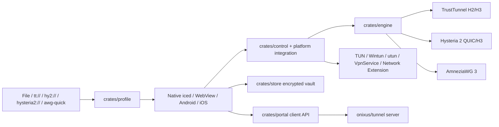

# Архитектура R-TrustTunnel

Дата: 2026-10-07. Статус: **фактическая архитектура текущего main (workspace 0.5.0)**.

## 1. Граница репозитория

Этот репозиторий содержит **клиентскую часть** R-TrustTunnel:

- desktop UI и системные VPN-службы;
- Android и iOS clients;
- общий Rust engine, profile/storage/control/mobile/update crates;
- client-side portal integration и API contract;
- packaging, CI и acceptance tooling.

Серверная реализация, administration UI и server deployment вынесены в
[onixus/tunnel](https://github.com/onixus/tunnel). В этом репозитории нет
`server/` и нет серверного deployment lifecycle. Это важная граница: клиент
не должен снова обрастать копией серверной логики.

## 2. Основной data flow

## 3. Workspace

Фактические Rust workspace members задаются корневым `Cargo.toml`:

- `crates/profile` — parsing, normalization, validation и export профилей;
- `crates/engine` — TrustTunnel/Hysteria/AmneziaWG transport/data plane;
- `crates/store` — encrypted profile storage;
- `crates/control` — control-plane types/lifecycle;
- `crates/desktop` — общая desktop application logic;
- `crates/mobile` — общая mobile policy/core integration;
- `crates/portal` — client-side portal protocol;
- `crates/update` — signed desktop update metadata/lifecycle;
- `apps/native` — iced desktop UI;
- `apps/webview` — Tauri WebView UI;
- `apps/tun` — desktop privileged tunnel/service path;
- `apps/android/core` — Rust часть Android;
- `apps/ios/core` — Rust часть iOS;
- `apps/inspect`, `apps/codec` — diagnostics/profile tooling.

Vendored `h2` and `h3` live under `vendor/` and are patched through
`[patch.crates-io]`.

## 4. Platform boundaries

### Windows

UI runs as the user. System VPN is owned by the SCM service using Wintun and WFP.
The service owns routes, DNS/network guard and recovery. The UI talks to it through
authenticated local IPC. Signed update metadata is separate from Authenticode.

### Linux

Desktop UI is Wayland-oriented and unprivileged. System VPN uses a host service,
TUN, nftables and systemd-resolved. Flatpak contains UI; host networking remains
outside the sandbox.

### macOS

Desktop UI and system-VPN packaging use the macOS-specific app/service path and
utun. Packages are currently preview/ad-hoc sealed. Automatic-update promotion is
kept separate from merely publishing a package.

### Android

Android uses `VpnService` and the shared Rust core through JNI. Android owns VPN
consent, Always-on/lockdown and per-app routing. Secrets are stored through Android
Keystore-backed storage. The Home Screen widget delegates to the normal validation
and consent flow rather than bypassing it.

### iOS

The iOS preview uses Swift/Network Extension with shared Rust core. On Demand and
widget actions are platform control-plane features; device installation requires
Apple signing.

## 5. Profiles and capabilities

Import success is not the same as transport support. A parsed profile is normalized,
validated and checked against engine/platform capabilities before Connect.

Supported families include:

- TrustTunnel endpoint/client TOML and `tt://`;
- Hysteria 2 `hy2://`, `hysteria2://` and supported YAML/JSON;
- R-TrustTunnel versioned JSON;
- AmneziaWG 3 `awg-quick`.

Secrets must not leak into diagnostics. Persistent profile storage has no plaintext
fallback. File export is an explicit credential-export operation.

## 6. Routing

There are two routing models:

1. profile-embedded routing policy, shared across supported clients;
2. desktop server-assigned route groups, synchronized from the portal and applied
   after validation.

Desktop 0.5.0 supports IPv4 TUN inclusion/exclusion and LAN bypass. Route groups
are desktop-only; Android/iOS do not consume the separate group API.

## 7. Update architecture

Desktop update metadata is Ed25519-signed and binds version, update sequence,
platform target, hashes, size and expiry to a compiled client identity.

Sequence 9 exists specifically to repair the old 0.5.0 sequence-7 identity problem.
A current client must not offer itself as a new version or select the wrong rollback
package. Windows latest is sequence 9; macOS automatic-update promotion remains
withheld until its acceptance gate is satisfied.

## 8. Security invariants

- no plaintext fallback for stored credentials;
- no silent TLS verification disablement;
- no implicit protocol downgrade when a profile requests an explicit transport;
- fail-closed system networking where the platform policy requests it;
- bounded parser/network queues and explicit limits;
- privileged networking stays outside WebView/mobile UI code;
- server-side responsibilities stay in `onixus/tunnel`, not duplicated here.

## 9. Source of truth

For current behavior prefer, in order:

1. code and package metadata in `main`;
2. newest release evidence;
3. current platform documents under `docs/`;
4. historical milestone documents.

This order exists because documentation naturally fossilizes faster than software,
which is apparently one of the constants of distributed systems.
