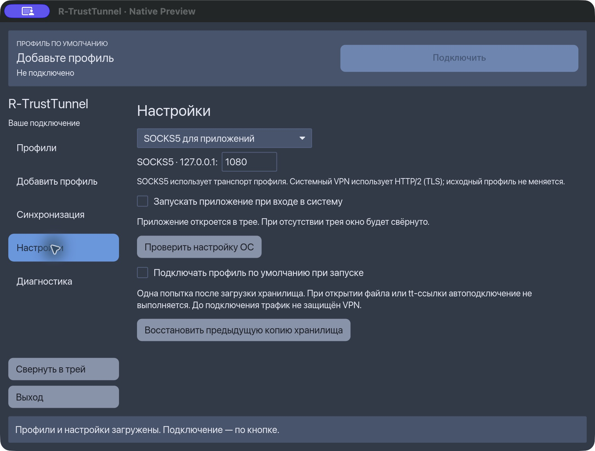

# Client screenshots / Скриншоты клиентов

These are actual application-window captures of the **v0.3.2-ui.1** macOS arm64
release, taken on October 1, 2026. Native is the installed Rust/iced application;
WebView was launched from the verified release PKG payload and uses local Tauri
assets. These are not browser mockups. Both show an empty vault and a disconnected
VPN, so no private server addresses, credentials or account data are exposed.
No profile, connection or system setting was changed to capture these screens.

Это реальные окна релизных macOS-приложений, а не макеты: Native — установленный
Rust/iced клиент, WebView — приложение из проверенного PKG. На снимках пустое
хранилище и отключённый VPN; адресов боевых серверов и учётных данных нет.

## Native: home / Главный экран

The top action connects the default profile. Profile import and other sections
are available from the sidebar. The button is disabled until a profile exists.

Верхняя кнопка подключает профиль по умолчанию. Пока профилей нет, она недоступна.
Импорт и остальные разделы находятся в боковом меню.

## Native: settings / Настройки

Connection mode and network settings now live in Settings. GUI autoconnect and
login startup are separate from the system's boot-level VPN protection.

Режим подключения и параметры сети перенесены в «Настройки». Автоподключение GUI
и запуск при входе отличаются от системной защиты VPN при загрузке.

## WebView: home / Главный экран

Profiles, Settings and Sync have separate tabs. Add a profile groups file and
link import; it is collapsed in this capture. WebView is a standalone desktop
application and does not require a browser or a local HTTP server.

Профили, настройки и синхронизация вынесены на отдельные вкладки. Импорт файлов
и ссылок сгруппирован в Add a profile; на снимке раздел свёрнут. Это самостоятельное
desktop-приложение, запуск браузера или локального HTTP-сервера ему не нужен.

## Scope / Границы

These screenshots establish appearance, not live network acceptance. The release
[validation record](../releases/v0.3.2-ui.1.md) describes actual platform tests.
Linux and Windows use the same native frontend but have different window chrome;
these images must not be presented as captures of those operating systems.
The released Android app blocks screenshots with `FLAG_SECURE`; no physical-phone
screenshot or altered security setting is included here.

Снимки показывают интерфейс, а не доказывают сетевую приёмку. Это именно macOS,
не Linux или Windows. Android блокирует скриншоты через `FLAG_SECURE`; защиту
ради документации не отключали. Старые PNG в этой папке относятся к предыдущему
дизайну и не являются снимками текущего выпуска.
